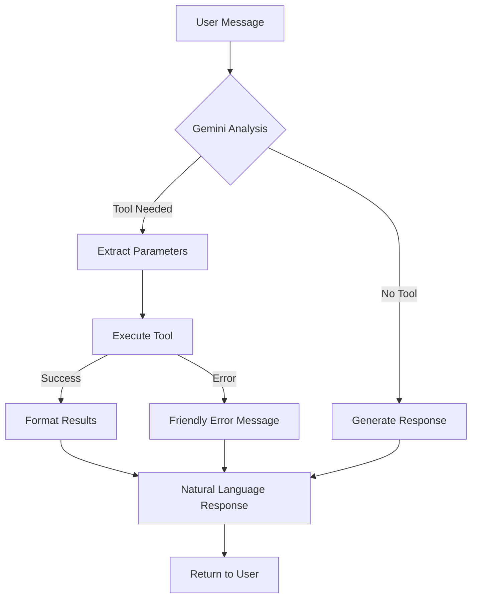

# AI Module Documentation

## Overview
The AI module provides intelligent medical data extraction, analysis, and conversational AI capabilities powered by Google's Gemini 2.5 Flash model and XGBoost machine learning. It includes:

- **Report Extraction**: Extract structured data (lab results, medications, diagnoses) from PDFs and images
- **Diabetes Risk Prediction**: XGBoost-based diabetes risk assessment with AI-generated narratives
- **RAG-based Medical Chat**: Context-aware conversations about patient medical history with tool calling support
- **AI Tool Calling**: 11 intelligent tools for appointments, reports, health insights, symptom checking, and more
- **Voice Chat**: Multilingual voice input/output with automatic transcription and translation (Kannada, Hindi, English)
- **Automated Case Summarization**: Comprehensive summaries of patient cases

All AI-extracted data is stored in MongoDB and linked to PostgreSQL records.

---

## 1. Core Concepts

### **Report Extraction**
- Automatically extracts structured data from medical reports (PDFs and images)
- Identifies: patient info, vital signs, lab results, diagnoses, medications, recommendations
- Stores complete extraction in MongoDB with `mongo_analysis_id` linking to PostgreSQL

### **Chat System (RAG-based)**
- Context-aware conversations about patient medical history
- Automatically loads relevant reports for context
- Maintains conversation history
- Supports report attachment/detachment during chat

### **Diabetes Prediction (Legacy)**
- Extracts 8 features from reports using Gemini
- Runs XGBoost model for diabetes risk prediction
- Generates AI narrative explaining the prediction

### **Access Control**
- **Patients**: Can analyze their own reports and chat about their own data
- **Doctors**: Can analyze assigned patients' reports and chat about assigned patients' data
- All operations validate active patient-doctor assignments

---

## 2. Database Schema (MongoDB)

### **`report_analysis` Collection**
Stores extracted medical data from reports.

| Field | Type | Description |
|-------|------|-------------|
| `_id` | `ObjectId` | MongoDB document ID. |
| `report_id` | `String` | PostgreSQL report UUID. |
| `patient_id` | `String` | Patient user ID. |
| `status` | `String` | Processing status (`completed`, `failed`). |
| `raw_text` | `String` | Extracted text from document. |
| `extracted_data` | `Object` | Structured medical data (see ReportExtraction). |
| `processing_time_ms` | `Integer` | Time taken for extraction. |
| `created_at` | `DateTime` | Timestamp of extraction. |

### **`chats` Collection**
Stores AI chat sessions and messages.

| Field | Type | Description |
|-------|------|-------------|
| `_id` | `ObjectId` | MongoDB document ID. |
| `chat_id` | `String` | UUID for the chat session. |
| `user_id` | `String` | User who started the chat. |
| `user_role` | `String` | `patient` or `doctor`. |
| `patient_id` | `String` | Patient whose data is discussed. |
| `title` | `String` | Auto-generated chat title (after first message). |
| `attached_report_ids` | `Array` | List of report IDs attached to this chat. |
| `context` | `String` | Pre-built context from reports (built on first message). |
| `messages` | `Array` | Array of message objects. |
| `created_at` | `DateTime` | Chat creation timestamp. |
| `updated_at` | `DateTime` | Last message timestamp. |

---

## 3. API Endpoints

### **Extract Report**
Extract complete medical data from a report and store in MongoDB.

- **Endpoint**: `POST /ai/extract-report/{report_id}`
- **Auth**: Required (Patient or Doctor)
- **Rate Limit**: 10 requests/minute
- **Request**: No body required
- **Response**:
```json
{
  "report_id": "550e8400-e29b-41d4-a716-446655440000",
  "status": "completed",
  "extracted_data": {
    "patient_name": "John Doe",
    "patient_age": "38",
    "patient_sex": "Male",
    "date_of_birth": "1987-05-15",
    "report_date": "2026-01-20",
    "report_type": "Lab Report",
    "vital_signs": {
      "blood_pressure": "120/80",
      "heart_rate": "72",
      "temperature": "98.6°F",
      "weight": "75 kg",
      "height": "175 cm",
      "bmi": "24.5"
    },
    "lab_results": [
      {
        "test_name": "HbA1c",
        "value": "5.2",
        "unit": "%",
        "reference_range": "4.0-5.6",
        "status": "Normal"
      },
      {
        "test_name": "Fasting Glucose",
        "value": "95",
        "unit": "mg/dL",
        "reference_range": "70-100",
        "status": "Normal"
      }
    ],
    "diagnoses": [
      "Type 2 Diabetes Mellitus - Controlled",
      "Hypertension - Stage 1"
    ],
    "medications": [
      {
        "name": "Metformin",
        "dosage": "500mg",
        "frequency": "Twice daily"
      },
      {
        "name": "Lisinopril",
        "dosage": "10mg",
        "frequency": "Once daily"
      }
    ],
    "recommendations": [
      "Continue current medications",
      "Monitor blood glucose daily",
      "Follow-up in 3 months"
    ],
    "additional_notes": "Patient showing good compliance with treatment plan."
  },
  "raw_text": "Full extracted text from the report...",
  "mongo_analysis_id": "69722c888259c6b087172bbc",
  "processing_time_ms": 3542,
  "extracted_at": "2026-01-22T10:30:00Z"
}
```

**Use Cases:**
- Extract structured data from uploaded reports
- View lab results in structured format
- Identify medications and diagnoses automatically
- Prepare data for chat context

**Error Cases:**
- `401`: Unauthorized - user not logged in
- `403`: Permission denied - user doesn't have access to this patient's reports
- `404`: Report not found
- `422`: Extraction failed - document unreadable or unsupported format

---

### **Start Chat**
Start a new AI chat session about a patient's medical history.

- **Endpoint**: `POST /ai/chat/start`
- **Auth**: Required (Patient or Doctor)
- **Rate Limit**: 10 requests/minute
- **Request Body**:
```json
{
  "patient_id": "patient-uuid-123",
  "report_ids": ["report-uuid-1", "report-uuid-2"]
}
```

**Request Fields:**
- `patient_id`: Required for doctors, auto-filled for patients (optional)
- `report_ids`: Optional list of specific reports to attach

**Response**:
```json
{
  "chat_id": "chat-uuid-abc123",
  "patient_id": "patient-uuid-123",
  "attached_report_ids": ["report-uuid-1", "report-uuid-2"],
  "created_at": "2026-01-22T10:30:00Z"
}
```

**Behavior:**
- For patients: `patient_id` defaults to their own ID
- For doctors: `patient_id` must be an assigned patient
- If no `report_ids` provided, all patient's reports are attached
- Context is built lazily on first message (not at chat creation)

---

### **Send Message**
Send a message in a chat and get AI response.

- **Endpoint**: `POST /ai/chat/{chat_id}/message`
- **Auth**: Required (Chat owner)
- **Rate Limit**: 30 requests/minute
- **Request Body**:
```json
{
  "message": "What were my latest HbA1c levels?",
  "attach_report_ids": ["report-uuid-3"]
}
```

**Request Fields:**
- `message`: User's question or message (1-2000 characters)
- `attach_report_ids`: Optional - attach additional reports with this message

**Response**:
```json
{
  "message_id": "msg-uuid-1",
  "response": "Based on your lab report from January 20, 2026, your HbA1c level was 5.2%, which is within the normal range (4.0-5.6%). This indicates good blood sugar control over the past 2-3 months.",
  "sources": ["report-uuid-1"],
  "title": "HbA1c Levels Discussion",
  "timestamp": "2026-01-22T10:31:00Z"
}
```

**Response Fields:**
- `message_id`: UUID of the user's message
- `response`: AI-generated answer
- `sources`: List of report IDs used to generate the answer
- `title`: Auto-generated chat title (only appears on first message)
- `timestamp`: When the message was sent

**Special Behavior:**
- First message triggers context building (may take longer)
- First message generates a chat title based on the question
- Subsequent messages use cached context for faster responses
- Last 10 messages are included as conversation history

---

### **Get Chat History**
Retrieve full conversation history for a chat.

- **Endpoint**: `GET /ai/chat/{chat_id}/history`
- **Auth**: Required (Chat owner)
- **Rate Limit**: 30 requests/minute
- **Response**:
```json
{
  "chat_id": "chat-uuid-abc123",
  "patient_id": "patient-uuid-123",
  "title": "HbA1c Levels Discussion",
  "attached_report_ids": ["report-uuid-1", "report-uuid-2"],
  "messages": [
    {
      "id": "msg-uuid-1",
      "role": "user",
      "content": "What were my latest HbA1c levels?",
      "timestamp": "2026-01-22T10:31:00Z",
      "sources": null
    },
    {
      "id": "msg-uuid-2",
      "role": "assistant",
      "content": "Based on your lab report from January 20, 2026...",
      "timestamp": "2026-01-22T10:31:05Z",
      "sources": ["report-uuid-1"]
    }
  ],
  "created_at": "2026-01-22T10:30:00Z",
  "updated_at": "2026-01-22T10:31:05Z"
}
```

---

### **List Chats**
Get all chat sessions for the authenticated user.

- **Endpoint**: `GET /ai/chats`
- **Auth**: Required
- **Rate Limit**: 30 requests/minute
- **Response**:
```json
{
  "total": 5,
  "chats": [
    {
      "chat_id": "chat-uuid-abc123",
      "patient_id": "patient-uuid-123",
      "title": "HbA1c Levels Discussion",
      "message_count": 6,
      "created_at": "2026-01-22T10:30:00Z",
      "updated_at": "2026-01-22T11:45:00Z"
    },
    {
      "chat_id": "chat-uuid-def456",
      "patient_id": "patient-uuid-123",
      "title": "Medication Questions",
      "message_count": 4,
      "created_at": "2026-01-21T14:20:00Z",
      "updated_at": "2026-01-21T14:35:00Z"
    }
  ]
}
```

**Use Cases:**
- Display chat history sidebar
- Show recent conversations
- Navigate between different chat topics

---

### **Update Chat Reports**
Add, remove, or replace attached reports in a chat.

- **Endpoint**: `PATCH /ai/chat/{chat_id}/reports`
- **Auth**: Required (Chat owner)
- **Rate Limit**: 20 requests/minute
- **Request Body**:
```json
{
  "report_ids": ["report-uuid-3", "report-uuid-4"],
  "action": "add"
}
```

**Actions:**
- `add`: Add new reports to existing attached reports
- `remove`: Remove specified reports from attached reports
- `replace`: Replace all attached reports with new list

**Response**:
```json
{
  "status": "success",
  "chat_id": "chat-uuid-abc123",
  "attached_report_ids": ["report-uuid-1", "report-uuid-2", "report-uuid-3", "report-uuid-4"],
  "message": "Reports updated successfully"
}
```

**Note**: Updating reports does NOT rebuild the context. The new reports will be available for future messages.

---

### **Delete Chat**
Delete a chat and all its messages permanently.

- **Endpoint**: `DELETE /ai/chat/{chat_id}`
- **Auth**: Required (Chat owner)
- **Rate Limit**: 10 requests/minute
- **Response**:
```json
{
  "status": "success",
  "message": "Chat deleted successfully"
}
```

**Warning**: This action is irreversible. All messages and chat data will be permanently deleted from MongoDB.

---

### **Analyze Report (Legacy - Diabetes Prediction)**
Legacy endpoint for diabetes risk prediction using XGBoost model.

- **Endpoint**: `POST /ai/analyze-report/{report_id}`
- **Auth**: Required (Patient or Doctor)
- **Rate Limit**: 10 requests/minute
- **Response**:
```json
{
  "report_id": "550e8400-e29b-41d4-a716-446655440000",
  "status": "completed",
  "extracted_features": {
    "gender": 1,
    "age": 45.0,
    "hypertension": 1,
    "heart_disease": 0,
    "smoking_history": 2,
    "bmi": 28.5,
    "HbA1c_level": 6.2,
    "blood_glucose_level": 140
  },
  "prediction": {
    "label": "diabetes",
    "confidence": 0.87
  },
  "narrative": "Based on the analysis, there is an 87% likelihood of diabetes risk. Key contributing factors include elevated HbA1c (6.2%), blood glucose levels (140 mg/dL), BMI (28.5), and presence of hypertension. Recommend consultation with healthcare provider for comprehensive evaluation.",
  "mongo_analysis_id": "69722c888259c6b087172bbc",
  "analyzed_at": "2026-01-22T10:30:00Z"
}
```

**Note**: This endpoint is maintained for compatibility. For general medical report extraction, use `/ai/extract-report/{report_id}` instead.

---

### **Summarize Case (Legacy)**
Generate AI summary of an entire case including all reports and notes.

- **Endpoint**: `POST /ai/summarize-case/{case_id}`
- **Auth**: Required (Patient or Doctor with access to case)
- **Rate Limit**: 5 requests/minute
- **Response**:
```json
{
  "case_id": "CASE20260118ABC123",
  "summary": "Patient presented with chief complaint of persistent fatigue and increased thirst. Initial labs revealed elevated HbA1c (6.5%) and fasting glucose (145 mg/dL). Diagnosis of Type 2 Diabetes Mellitus was made. Patient started on Metformin 500mg twice daily. Follow-up labs show improvement with HbA1c decreased to 5.8%.",
  "key_findings": [
    "Initial HbA1c: 6.5%",
    "Current HbA1c: 5.8% (improved)",
    "Blood pressure controlled at 125/82",
    "Patient compliant with medication regimen"
  ],
  "recommendations": [
    "Continue Metformin as prescribed",
    "Schedule follow-up in 3 months",
    "Recommend nutritionist consultation",
    "Monitor blood glucose twice daily"
  ],
  "generated_at": "2026-01-22T10:30:00Z"
}
```

---

### **Ask Question (Legacy - Use Chat Instead)**
RAG-based Q&A about patient's medical history (single question/answer).

- **Endpoint**: `POST /ai/ask`
- **Auth**: Required
- **Rate Limit**: 20 requests/minute
- **Request Body**:
```json
{
  "patient_id": "patient-uuid-123",
  "question": "What medications am I currently taking?"
}
```

**Response**:
```json
{
  "answer": "Based on your medical records, you are currently taking: 1) Metformin 500mg twice daily for diabetes management, 2) Lisinopril 10mg once daily for blood pressure control, and 3) Atorvastatin 20mg at bedtime for cholesterol management.",
  "sources": ["report-uuid-1", "report-uuid-2"]
}
```

**Note**: This endpoint is maintained for compatibility. For conversational AI with context, use the chat endpoints instead.

---

### **Get Health Insights**
Generate AI-powered health insights, risk factors, and trends for a patient.

- **Endpoint**: `GET /ai/insights/{patient_id}`
- **Auth**: Required (Patient themselves or assigned Doctor)
- **Rate Limit**: 10 requests/minute
- **Response**:
```json
{
  "patient_id": "patient-uuid-123",
  "insights": [
    "Your HbA1c levels have improved by 0.7% over the past 3 months, indicating better diabetes control",
    "Blood pressure readings show consistent control within target range",
    "Medication adherence is excellent based on prescription refill records"
  ],
  "risk_factors": [
    "BMI of 28.5 indicates overweight category - weight management recommended",
    "Family history of cardiovascular disease - regular monitoring advised"
  ],
  "trends": [
    "HbA1c trending downward: 6.5% → 6.0% → 5.8%",
    "Fasting glucose levels stable around 95-105 mg/dL",
    "Weight decreased by 3 kg over 3 months"
  ],
  "generated_at": "2026-01-22T10:30:00Z"
}
```

---

## 4. Data Models (Pydantic)

### **`ReportExtraction`**
Complete structured extraction from medical reports.

| Field | Type | Description |
|-------|------|-------------|
| `patient_name` | `str` | Patient's full name (default: "N/A"). |
| `patient_age` | `str` | Patient age (default: "N/A"). |
| `patient_sex` | `str` | Male/Female/Other (default: "N/A"). |
| `date_of_birth` | `str` | Date of birth if found (default: "N/A"). |
| `report_date` | `str` | Date of the report (default: "N/A"). |
| `report_type` | `str` | Lab Report, Prescription, Imaging, etc. |
| `vital_signs` | `VitalSigns` | Blood pressure, heart rate, temperature, weight, height, BMI. |
| `lab_results` | `list[LabResult]` | All lab test results. |
| `diagnoses` | `list[str]` | Diagnosed conditions. |
| `medications` | `list[Medication]` | Prescribed medications. |
| `recommendations` | `list[str]` | Doctor recommendations. |
| `additional_notes` | `str` | Any other relevant information. |

### **`LabResult`**
Individual lab test result.

| Field | Type | Description |
|-------|------|-------------|
| `test_name` | `str` | Name of the test (e.g., HbA1c, Cholesterol). |
| `value` | `str` | Test value as string. |
| `unit` | `str` | Unit of measurement (default: "N/A"). |
| `reference_range` | `str` | Normal reference range (default: "N/A"). |
| `status` | `str` | Normal, High, Low, or N/A. |

### **`Medication`**
Medication entry from prescription/report.

| Field | Type | Description |
|-------|------|-------------|
| `name` | `str` | Drug name. |
| `dosage` | `str` | Dosage amount (default: "N/A"). |
| `frequency` | `str` | How often taken (default: "N/A"). |

### **`VitalSigns`**
Vital signs extracted from report.

| Field | Type | Description |
|-------|------|-------------|
| `blood_pressure` | `str` | Blood pressure reading (default: "N/A"). |
| `heart_rate` | `str` | Heart rate in bpm (default: "N/A"). |
| `temperature` | `str` | Body temperature (default: "N/A"). |
| `weight` | `str` | Weight with unit (default: "N/A"). |
| `height` | `str` | Height with unit (default: "N/A"). |
| `bmi` | `str` | Body Mass Index (default: "N/A"). |

### **`StartChatRequest`**
Request to start a new chat.

| Field | Type | Required | Description |
|-------|------|----------|-------------|
| `patient_id` | `str` | For doctors | Patient UUID (auto-filled for patients). |
| `report_ids` | `list[str]` | No | Specific reports to attach (optional). |

### **`ChatMessageRequest`**
Request to send a message.

| Field | Type | Required | Description |
|-------|------|----------|-------------|
| `message` | `str` | Yes | User's message (1-2000 characters). |
| `attach_report_ids` | `list[str]` | No | Additional reports to attach. |

### **`ChatMessage`**
Single message in chat history.

| Field | Type | Description |
|-------|------|-------------|
| `id` | `str` | Message UUID. |
| `role` | `str` | `user` or `assistant`. |
| `content` | `str` | Message text. |
| `timestamp` | `datetime` | When message was sent. |
| `sources` | `list[str]` | Report IDs used (assistant only). |

---

## 5. Frontend Integration Guide

### **Report Extraction**
```typescript
// Extract data from a report
const extractReport = async (reportId: string) => {
  try {
    const result = await api.post(`/ai/extract-report/${reportId}`);
    
    // Display extracted data
    console.log('Patient:', result.extracted_data.patient_name);
    console.log('Report Type:', result.extracted_data.report_type);
    console.log('Lab Results:', result.extracted_data.lab_results);
    
    return result;
  } catch (error) {
    if (error.status === 422) {
      showError('Could not extract data from this report');
    }
  }
};

// Display lab results
const renderLabResults = (labResults) => {
  return labResults.map(result => (
    <LabResultCard key={result.test_name}>
      <h4>{result.test_name}</h4>
      <p>{result.value} {result.unit}</p>
      <p>Reference: {result.reference_range}</p>
      <Badge status={result.status}>{result.status}</Badge>
    </LabResultCard>
  ));
};
```

### **Chat Interface**
```typescript
// Start a new chat
const startChat = async (patientId?: string, reportIds?: string[]) => {
  const response = await api.post('/ai/chat/start', {
    patient_id: patientId, // Optional for patients
    report_ids: reportIds
  });
  
  return response.chat_id;
};

// Send a message
const sendMessage = async (chatId: string, message: string) => {
  const response = await api.post(`/ai/chat/${chatId}/message`, {
    message: message
  });
  
  // Update UI with response
  addMessageToChat({
    role: 'user',
    content: message,
    timestamp: new Date()
  });
  
  addMessageToChat({
    role: 'assistant',
    content: response.response,
    timestamp: response.timestamp,
    sources: response.sources
  });
  
  // Update title if this was the first message
  if (response.title) {
    updateChatTitle(chatId, response.title);
  }
  
  return response;
};

// Load chat history
const loadChatHistory = async (chatId: string) => {
  const response = await api.get(`/ai/chat/${chatId}/history`);
  
  setChatTitle(response.title || 'New Chat');
  setMessages(response.messages);
  setAttachedReports(response.attached_report_ids);
  
  return response;
};

// List all chats
const loadChats = async () => {
  const response = await api.get('/ai/chats');
  return response.chats;
};

// Delete a chat
const deleteChat = async (chatId: string) => {
  await api.delete(`/ai/chat/${chatId}`);
  // Remove from UI
};
```

### **Chat UI Component Example**
```typescript
const ChatInterface = ({ chatId }) => {
  const [messages, setMessages] = useState([]);
  const [input, setInput] = useState('');
  const [loading, setLoading] = useState(false);

  const handleSend = async () => {
    if (!input.trim()) return;
    
    setLoading(true);
    try {
      const response = await sendMessage(chatId, input);
      setInput('');
    } catch (error) {
      showError('Failed to send message');
    } finally {
      setLoading(false);
    }
  };

  return (
    <div className="chat-container">
      <div className="messages">
        {messages.map(msg => (
          <MessageBubble
            key={msg.id}
            role={msg.role}
            content={msg.content}
            timestamp={msg.timestamp}
            sources={msg.sources}
          />
        ))}
      </div>
      
      <div className="input-area">
        <textarea
          value={input}
          onChange={(e) => setInput(e.target.value)}
          placeholder="Ask about your medical history..."
          maxLength={2000}
        />
        <button onClick={handleSend} disabled={loading}>
          {loading ? 'Sending...' : 'Send'}
        </button>
      </div>
    </div>
  );
};
```

---

## 6. Common Use Cases

### **Automated Report Processing**
1. Patient uploads lab report PDF
2. Report confirmation triggers background extraction
3. AI extracts lab results, diagnoses, medications
4. Structured data stored in MongoDB
5. Doctor views extracted data instead of reading PDF

### **Medical Q&A Chat**
1. Patient starts chat about their medical history
2. System loads all relevant reports
3. Patient asks: "What were my last cholesterol levels?"
4. AI searches through reports and provides answer with sources
5. Conversation continues with context maintained

### **Doctor Review Workflow**
1. Doctor opens patient profile
2. Views extracted lab results from multiple reports
3. Starts chat to ask specific questions
4. Attaches relevant reports to chat
5. Gets insights and trends for decision support

### **Case Summarization**
1. Doctor needs quick overview of complex case
2. Calls summarize endpoint with case_id
3. AI generates summary from all reports and notes
4. Key findings and recommendations highlighted
5. Summary included in discharge paperwork

---

## 7. Security & Access Control

| Role | Extract Report | Start Chat | Send Message | View Insights |
|------|----------------|------------|--------------|---------------|
| **Patient** | ✅ (own) | ✅ (own) | ✅ (own) | ✅ (own) |
| **Doctor** | ✅ (assigned) | ✅ (assigned) | ✅ (own chats) | ✅ (assigned) |
| **Admin** | ✅ (all) | ✅ (all) | ✅ (own chats) | ✅ (all) |

**Validation:**
- All endpoints verify active patient-doctor assignments
- Chat access restricted to chat creator
- Report extraction requires access to the patient's reports
- MongoDB queries filtered by user permissions

---

## 8. AI Model Configuration

### **Gemini 2.5 Flash**
- **Purpose**: Text extraction, structured data extraction, conversational AI
- **Model**: `gemini-2.5-flash`
- **Temperature**: 0.1 (for extraction), 0.7 (for chat)
- **Max Tokens**: 8192
- **Features Used**:
  - Vision API for image/PDF processing
  - JSON mode for structured extraction
  - Function calling for RAG

### **XGBoost Model**
- **Purpose**: Diabetes risk prediction
- **Features**: 8 inputs (gender, age, hypertension, heart_disease, smoking_history, bmi, HbA1c, blood_glucose)
- **Output**: Binary classification (diabetes/no_diabetes) with confidence score
- **Model File**: `src/ml_model/diabetes_xgboost_model.json`

---

## 9. Rate Limiting

| Endpoint | Rate Limit | Purpose |
|----------|------------|---------|
| Extract Report | 10/minute | Prevent API abuse, expensive operation |
| Analyze Report | 10/minute | Prevent API abuse, expensive operation |
| Start Chat | 10/minute | Reasonable for normal usage |
| Send Message | 30/minute | Allow active conversations |
| Get History | 30/minute | Frequent access allowed |
| List Chats | 30/minute | Frequent access allowed |
| Delete Chat | 10/minute | Prevent accidental mass deletion |
| Update Reports | 20/minute | Allow flexibility in chat setup |
| Summarize Case | 5/minute | Very expensive operation |
| Ask Question | 20/minute | Allow multiple questions |
| Get Insights | 10/minute | Moderate expense |

**Rate Limit Response**:
```json
{
  "error": "Rate limit exceeded",
  "retry_after": 60
}
```
Status Code: `429 Too Many Requests`

---

## 10. Performance Considerations

### **Processing Times**
- **Report Extraction**: 3-8 seconds (depends on document size)
- **Chat Context Building**: 5-10 seconds (first message only)
- **Chat Message**: 2-4 seconds (subsequent messages)
- **Diabetes Analysis**: 5-12 seconds (extraction + prediction + narrative)
- **Case Summary**: 10-20 seconds (multiple reports)

### **Optimization Tips**
- Cache extracted data - don't re-extract the same report
- Build chat context once per session
- Use background tasks for non-critical extractions
- Implement loading indicators for AI operations
- Show progress for long-running operations

---

## 11. Get My Profile (`get_my_profile`)
Retrieves the user's personal medical profile.

**When Activated:**
- "What is my blood group?"
- "Do I have any allergies?"
- "Show my profile"

**Parameters:**
- None

**Example Response:**
> "Name: Rahul
> Age: 28
> Gender: Male
> Blood Group: O+
> Allergies: Peanuts, Penicillin
> Current Medications: Metformin 500mg"

---

## 12. Error Handling

### **Common Errors**

| Error | Status Code | Cause | Solution |
|-------|-------------|-------|----------|
| Unauthorized | 401 | Not logged in | Redirect to login |
| Permission denied | 403 | No access to patient | Verify assignment |
| Report not found | 404 | Invalid report_id | Check report exists |
| Chat not found | 404 | Invalid chat_id | Verify chat exists |
| Extraction failed | 422 | Unreadable document | Try different format or manual entry |
| Rate limit exceeded | 429 | Too many requests | Wait and retry |
| AI service error | 500 | Gemini API failure | Retry or show fallback |

### **Best Practices**
- Always show loading states for AI operations
- Provide fallback options if extraction fails
- Allow manual data entry as backup
- Cache successful extractions
- Implement exponential backoff for retries
- Show clear error messages to users

---

## 12. MongoDB Indexes

For optimal performance, ensure these indexes exist:

```javascript
// report_analysis collection
db.report_analysis.createIndex({ "report_id": 1 }, { unique: true });
db.report_analysis.createIndex({ "patient_id": 1 });
db.report_analysis.createIndex({ "created_at": -1 });

// chats collection
db.chats.createIndex({ "chat_id": 1 }, { unique: true });
db.chats.createIndex({ "user_id": 1, "updated_at": -1 });
db.chats.createIndex({ "patient_id": 1 });
```

---

---

## 13. Voice Chat (Multilingual Support)

### **Overview**
The voice chat feature enables users to interact with the AI using voice messages in any language. The system automatically transcribes the audio, translates it to English for processing, executes any necessary tools, and translates the response back to the user's preferred language.

### **Supported Languages**
- **Input**: Any language (Kannada, Hindi, English, Telugu, Tamil, etc.)
- **Output**: English, Kannada, Hindi (user-selectable)

### **Voice Message Endpoint**
Send a voice message and receive an AI response with tool calling support.

-**Endpoint**: `POST /ai/chat/{chat_id}/voice-message`
- **Auth**: Required (Chat owner)
- **Rate Limit**: 20 requests/minute
- **Content-Type**: `multipart/form-data`

**Request Parameters:**
- `audio_file`: Audio file (File, required) - Formats: webm, wav, mp3, m4a
- `language`: Response language (Form, optional) - Options: `english`, `kannada`, `hindi` (default: `english`)
- `attach_report_ids`: Comma-separated report IDs (Form, optional)

**Example (Python):**
```python
import requests

files = {
    'audio_file': ('message.webm', open('message.webm', 'rb'), 'audio/webm')
}
data = {
    'language': 'kannada',  # Response in Kannada
    'attach_report_ids': 'report-1,report-2'
}

response = requests.post(
    'https://api.example.com/ai/chat/{chat_id}/voice-message',
    headers={'Authorization': 'Bearer YOUR_TOKEN'},
    files=files,
    data=data
)
```

**Example (JavaScript/FormData):**
```javascript
const formData = new FormData();
formData.append('audio_file', audioBlob, 'message.webm');
formData.append('language', 'hindi');  // Response in Hindi
formData.append('attach_report_ids', 'report-1,report-2');

fetch(`https://api.example.com/ai/chat/${chatId}/voice-message`, {
  method: 'POST',
  headers: {
    'Authorization': `Bearer ${token}`
  },
  body: formData
});
```

**Response** (same as text message):
```json
{
  "message_id": "msg-uuid-1",
  "response": "ನಿಮ್ಮ ಇತ್ತೀಚಿನ HbA1c ಮಟ್ಟಗಳು 5.2% ಆಗಿದ್ದು, ಇದು ಸಾಮಾನ್ಯ ವ್ಯಾಪ್ತಿಯಲ್ಲಿದೆ...",
  "sources": ["report-uuid-1"],
  "title": "HbA1c Discussion",
  "timestamp": "2026-01-22T10:31:00Z"
}
```

### **Processing Pipeline**
1. **Transcription**: Audio → Text (any language detected automatically)
2. **Translation**: Non-English → English (for AI processing)
3. **Tool Calling**: AI determines if tools are needed and executes them
4. **Response Generation**: AI creates contextual response
5. **Translation**: English response → User's preferred language

### **Use Cases**
- **Rural healthcare**: Users can speak in local languages (Kannada, Hindi, etc.)
- **Accessibility**: Easier for users with limited literacy
- **Convenience**: Faster than typing medical terms
- **Multilingual support**: Seamless experience in native language

**Important Notes:**
- Audio is transcribed using Gemini 2.5 Flash multimodal API
- Language detection is automatic - no need to specify input language
- Translation preserves medical terminology accuracy
- Tool calling works the same as text chat (appointments, reports, etc.)

---

## 14. AI Tool Calling Framework

### **Overview**
The AI chat system includes an intelligent tool calling framework that allows Gemini to autonomously execute actions based on user requests. The AI can book appointments, retrieve medical reports, check symptoms, and more - all through natural conversation.

### **How It Works**
1. User sends a message (text or voice)
2. Gemini analyzes the request and determines if a tool is needed
3. If needed, Gemini calls the appropriate tool with extracted parameters
4. Tool executes and returns structured results
5. Gemini formats the results into a natural language response
6. User receives a conversational response

### **Available Tools**

#### **1. Create Appointment** (`create_appointment`)
Books a new appointment with a doctor.

**When Activated:**
- "Book an appointment with Dr. Smith tomorrow at 2 PM"
- "Schedule a follow-up on March 15th at 10:30 AM"
- "I want to see Dr. Kumar next week"

**Parameters:**
- `doctor_name_or_id`: Doctor's name or user ID
- `date`: Date (YYYY-MM-DD)
- `time`: Time (HH:MM, 24-hour format, interpreted as IST)
- `type`: Consultation, Follow-up, or Emergency
- `reason`: Reason for appointment (optional)

**Validations:**
- ✅ Patient must be assigned to the doctor
- ✅ Cannot book in the past
- ✅ Checks for overlapping appointments
- ✅ Validates appointment type (case-insensitive matching)
- ✅ Times are interpreted as IST (Asia/Kolkata) and stored as UTC

**Example Response:**
> "I've successfully booked your consultation appointment with Dr. Priya Sharma for March 15, 2026 at 10:30 AM IST. You'll receive a confirmation notification shortly."

**Error Examples:**
- "You are not assigned to Dr. Smith. You can only book with your assigned doctors."
- "Cannot book appointment in the past. The requested time (2026-01-15 02:00 PM IST) has already passed."
- "Dr. Sharma already has an appointment from 10:00 to 10:30. Please choose a different time."
- "Invalid appointment type: 'checkup'. Valid types are: Consultation, Follow-up, Emergency"

---

#### **2. List My Appointments** (`list_my_appointments`)
Retrieves user's upcoming or past appointments.

**When Activated:**
- "Show me my upcoming appointments"
- "What appointments do I have this week?"
- "List my appointments from January to February"

**Parameters:**
- `start_date`: Filter from date (YYYY-MM-DD, optional) - supports multiple date formats
- `end_date`: Filter to date (YYYY-MM-DD, optional) - supports multiple date formats
- `status`: Scheduled, Completed, Cancelled, or No-show (optional, case-insensitive)

**Validations:**
- ✅ Safe date parsing with clear error messages
- ✅ Case-insensitive status matching
- ✅ Works for both patients and doctors

**Example Response:**
> "You have 2 upcoming appointments:
> 1. Dr. Sharma - March 15, 2026 at 10:30 AM (Consultation)
> 2. Dr. Kumar - March 22, 2026 at 3:00 PM (Follow-up)"

---

#### **3. Cancel Appointment** (`cancel_appointment`)
Cancels an existing appointment.

**When Activated:**
- "Cancel my appointment with Dr. Sharma"
- "I need to cancel my March 15th appointment"
- "Remove my upcoming appointment"

**Parameters:**
- `appointment_identifier`: Date, doctor name, or appointment type

**Example Response:**
> "I've cancelled your appointment with Dr. Sharma scheduled for March 15, 2026 at 10:30 AM. The doctor has been notified."

---

#### **4. Get Latest Reports** (`get_latest_reports`)
Retrieves summaries of recent medical reports.

**When Activated:**
- "Show me my latest lab reports"
- "What are my recent test results?"
- "Get my last 10 reports"

**Parameters:**
- `limit`: Number of reports to return (1-20, default: 5)

**Access Control:**
- **Patients**: See their own reports
- **Doctors**: See reports from all assigned patients (with patient names)

**Example Response (Patient):**
> "Here are your 3 most recent reports:
> 1. Lab Report (Jan 20, 2026): HbA1c 5.2%, Cholesterol 180 mg/dL
> 2. Blood Test (Jan 10, 2026): Glucose 95 mg/dL, Normal ranges
> 3. Annual Checkup (Dec 15, 2025): All vitals normal"

**Example Response (Doctor):**
> "Here are recent reports from your patients:
> 1. Lab Report - Rahul Kumar (Jan 20, 2026): HbA1c test results
> 2. Blood Test - Priya Sharma (Jan 15, 2026): Complete blood count"

---

#### **5. Get Report Details** (`get_report_details`)
Retrieves detailed extraction from a specific report.

**When Activated:**
- "Show me details of my January 20th report"
- "What were all the results in my latest lab report?"
- "Get full details of report ABC123"

**Parameters:**
- `report_id`: Report ID to retrieve

**Access Control:**
- **Patients**: Can only view their own reports
- **Doctors**: Can view reports of assigned patients only

**Validations:**
- ✅ ObjectId format validation for MongoDB references
- ✅ MongoDB connection check before query
- ✅ Proper access control for both patients and doctors

**Example Response:**
> "Your Lab Report from January 20, 2026:
> - HbA1c: 5.2% (Normal: 4.0-5.6%)
> - Fasting Glucose: 95 mg/dL (Normal: 70-100)
> - Total Cholesterol: 180 mg/dL (Normal: <200)
> - Blood Pressure: 120/80 mmHg
> - Medications: Metformin 500mg twice daily"

**Error Examples:**
- "Access denied - patient not assigned to you"
- "This report has not been analyzed yet"
- "Invalid analysis reference. Report may need re-analysis."

---

#### **6. Get Health Insights** (`get_health_insights`)
Generates AI-powered health insights from patient data.

**When Activated:**
- "Give me my health insights"
- "What are my health trends?"
- "Analyze my medical history"

**Example Response:**
> "Based on your medical history:
> 
> **Key Insights:**
> - Your HbA1c has improved from 6.5% to 5.2% over 3 months - excellent progress!
> - Blood pressure is consistently well-controlled
> - Weight has decreased by 3 kg
> 
> **Risk Factors:**
> - Family history of diabetes - continue monitoring
> - BMI of 26 indicates overweight - weight management recommended
> 
> **Trends:**
> - Blood sugar levels trending downward consistently
> - Medication adherence is excellent"

---

#### **7. List My Doctors** (`list_my_doctors`)
Shows all doctors assigned to the patient.

**When Activated:**
- "Who are my doctors?"
- "Show me my assigned doctors"
- "Which doctors can I book with?"

**Parameters:**
- `limit`: Max number of doctors to return (1-50, default: 20)
- `name`: Filter by doctor name (partial match, e.g., "Sharma")

**Example Response:**
> "You are currently assigned to 2 doctors:
> 1. Dr. Priya Sharma (Endocrinologist)
> 2. Dr. Rahul Kumar (General Physician)"

---

#### **8. List My Patients** (`list_my_patients`)
Shows all patients assigned to the doctor (doctors only).

**When Activated:**
- "Show me my patients"
- "List all my assigned patients"
- "Who am I treating?"

**Parameters:**
- `limit`: Max number of patients to return (1-50, default: 20)

**Example Response:**
> "You have 15 active patients. Showing first 20:
> 1. John Doe (Age: 38)
> 2. Jane Smith (Age: 45)
> 3. Ram Kumar (Age: 52)"

---

#### **9. Get Booked Slots** (`get_booked_slots`)
Shows booked appointment slots for a doctor on a specific date.

**When Activated:**
- "Is Dr. Sharma available on March 15th?"
- "Show me Dr. Kumar's schedule for tomorrow"
- "What slots are booked for Dr. Patel on March 20th?"

**Parameters:**
- `doctor_name_or_id`: Doctor's name or user ID
- `date`: Date (YYYY-MM-DD)

**Example Response:**
> "Dr. Sharma has 3 appointments booked on March 15, 2026:
> - 10:00 AM - 10:30 AM (Consultation)
> - 2:00 PM - 2:30 PM (Follow-up)
> - 4:30 PM - 5:00 PM (Consultation)
> 
> Available slots: 11:00 AM, 12:00 PM, 3:00 PM"

**Note**: Patient names are anonymized for non-doctors (e.g., "J***")

**Error Examples:**
- "Multiple doctors match 'Kumar': Dr. Kumar Singh, Dr. Rahul Kumar. Please specify the full name."
- "Doctor 'Dr. XYZ' not found"

---

#### **10. Check Symptoms** (`check_symptoms`)
Analyzes symptoms and provides triage recommendations.

**When Activated:**
- "I have a headache and fever"
- "I'm feeling dizzy and nauseous"
- "Check my symptoms: cough, fatigue, body ache"

**Parameters:**
- `symptoms`: List of symptoms

**Example Response:**
> "Based on your symptoms (headache, fever), this appears to be a moderate concern.
> 
> **Severity**: Moderate
> **Possible Causes**: Viral infection, flu, or migraine
> **Recommendations**:
> - Monitor temperature regularly
> - Stay hydrated
> - Rest
> - If fever exceeds 102°F or persists beyond 3 days, consult a doctor
> - Over-the-counter pain relievers may help
> 
> ⚠️ **Disclaimer**: This is not a medical diagnosis. Please consult a healthcare professional for accurate diagnosis and treatment."

---

#### **11. Get My Profile** (`get_my_profile`)
Retrieves the user's personal medical profile.

**When Activated:**
- "What is my blood group?"
- "Do I have any allergies?"
- "Show my profile"

**Parameters:**
- None

**Example Response:**
> "Here is your profile:
> - Name: Rahul
> - Age: 28
> - Gender: Male
> - Blood Group: O+
> - Allergies: Peanuts, Penicillin
> - Current Medications: Metformin 500mg"

---

### **Tool Calling Examples**

**Example 1: Multi-step conversation**
```
User: "Do I have any appointments this week?"
AI: [Calls list_my_appointments]
→ "You have one appointment: Dr. Sharma on March 15 at 10:30 AM."

User: "I need to cancel that"
AI: [Calls cancel_appointment]
→ "I've cancelled your appointment with Dr. Sharma on March 15."
```

**Example 2: Complex request**
```
User: "Book me with Dr. Kumar for next Monday at 2 PM for a follow-up"
AI: [Calls create_appointment with:
     doctor_name="Dr. Kumar"
     appointment_date="2026-03-17"
     appointment_time="14:00"
     appointment_type="follow-up"]
→ "Your follow-up appointment with Dr. Kumar is confirmed for Monday, March 17 at 2:00 PM."
```

**Example 3: Health inquiry**
```
User: "What were my latest lab results and give me insights"
AI: [Calls get_latest_reports then get_health_insights]
→ "Your latest report from Jan 20 shows HbA1c at 5.2%... 
   [Full report details]
   
   Based on your history, your diabetes control has improved significantly..."
```

### **Tool Execution Flow**



### **Error Handling**

The AI gracefully handles tool errors with clear, actionable messages:

**Appointment Errors:**
- **Doctor not found**: "Doctor 'Dr. XYZ' not found. Please check the name and try again."
- **Not assigned**: "You are not assigned to Dr. Smith. You can only book with your assigned doctors."
- **Past date**: "Cannot book appointment in the past. The requested time (2026-01-15 02:00 PM IST) has already passed."
- **Overlap**: "Dr. Sharma already has an appointment from 10:00 to 10:30. Please choose a different time."
- **Invalid type**: "Invalid appointment type: 'checkup'. Valid types are: Consultation, Follow-up, Emergency"
- **Invalid date**: "Invalid start_date format: 'tomorrow'. Expected YYYY-MM-DD."

**Report Errors:**
- **Access denied**: "Access denied - patient not assigned to you"
- **Not analyzed**: "This report has not been analyzed yet"
- **Invalid reference**: "Invalid analysis reference. Report may need re-analysis."
- **No connection**: "Database connection unavailable for analysis retrieval"

**General Errors:**
- **Permission denied**: "Only patients can book appointments"
- **Empty response**: "I'm sorry, I couldn't generate a response. Please try again."

### **Timezone Handling**

All appointment times are interpreted as **IST (Asia/Kolkata)** timezone:
- User says "2 PM" → Stored as 2:00 PM IST (8:30 AM UTC)
- Displayed times are in IST format
- This ensures correct scheduling for Indian users

### **Doctor Name Resolution**

Doctor names are resolved using a multi-step approach:
1. **Exact ID match** — if the input is a user ID, returns exact match
2. **Case-insensitive name search** — uses `ILIKE %name%` for partial matching
3. **Ambiguity handling** — if multiple doctors match, returns an error with all matching names

**Example:**
- Input: `"Kumar"` → Matches `Dr. Kumar Singh` and `Dr. Rahul Kumar` → Error: "Multiple doctors match 'Kumar': Dr. Kumar Singh, Dr. Rahul Kumar. Please specify the full name."
- Input: `"Priya Sharma"` → Single match → Returns `Dr. Priya Sharma`

### **Context Caching**

Chat context is built from patient data and attached reports. To balance freshness and performance:
- **First message**: Context is always built fresh
- **Subsequent messages**: Context is reused if it's less than **30 minutes** old
- **Stale context**: Automatically rebuilt after 30 minutes (e.g., if new reports were uploaded)
- **Context timestamp** is stored alongside context in MongoDB (`context_built_at`)

### **Tool Call Safety**

To prevent abuse or infinite loops:
- Maximum **3 tool calls per message** — additional calls are rejected
- Tool call count is tracked per message request
- Each tool call is individually logged with tool name, args, and result

### **Best Practices**

1. **Natural Language**: Users can ask in natural conversational style
2. **Flexible Inputs**: Multiple date formats supported (YYYY-MM-DD, DD-MM-YYYY, etc.)
3. **Context Awareness**: AI remembers conversation context
4. **Error Recovery**: Clear error messages with alternatives
5. **Privacy**: Patient data anonymization where needed
6. **Access Control**: Proper authorization checks for all data access
7. **Structured Results**: Tool results sent as JSON for better AI formatting

---

## 15. Future Enhancements

- **Report Comparison**: Compare lab results across time periods
- **Predictive Analytics**: More ML models for different conditions
- **Automated Reminders**: AI-suggested follow-ups based on trends
- **Export Reports**: Download chat conversations as PDF
- **Voice Output**: Text-to-speech for responses
- **Real-time Translation**: Live translation during doctor-patient calls
