# Healthcare & Diabetes Dashboard - Complete Project Workflows

**Last Updated:** January 23, 2026  
**Version:** 1.0

This document contains comprehensive Mermaid diagrams showing the complete architecture, data flow, and user workflows for the Healthcare & Diabetes Dashboard system.

---

## Table of Contents
1. [System Architecture Overview](#1-system-architecture-overview)
2. [Database Architecture](#2-database-architecture)
3. [Authentication & Onboarding Flow](#3-authentication--onboarding-flow)
4. [Doctor-Patient Assignment Flow](#4-doctor-patient-assignment-flow)
5. [Medical Case Management Flow](#5-medical-case-management-flow)
6. [Report Upload & AI Analysis Flow](#6-report-upload--ai-analysis-flow)
7. [AI Chat System Flow](#7-ai-chat-system-flow)
8. [Diabetes Dashboard Flow](#8-diabetes-dashboard-flow)
9. [Notification System Flow](#9-notification-system-flow)
10. [Complete User Journey](#10-complete-user-journey)

---

## 1. System Architecture Overview

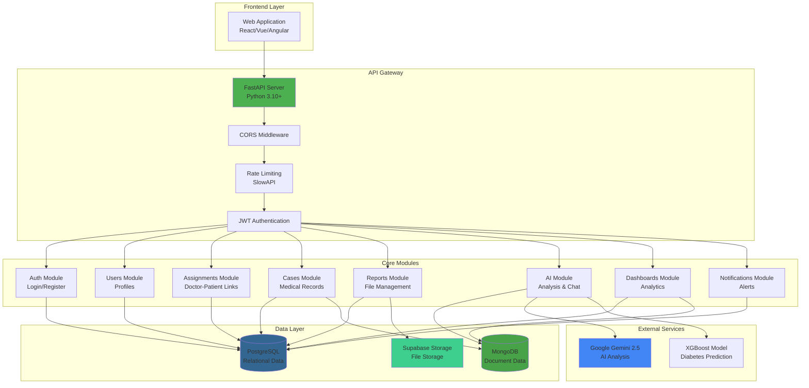

---

## 2. Database Architecture

```mermaid
erDiagram
    USERS ||--o| PATIENTS : "1:1"
    USERS ||--o| DOCTORS : "1:1"
    USERS ||--o{ NOTIFICATIONS : "has many"
    DOCTORS ||--o{ ASSIGNMENTS : "has many"
    PATIENTS ||--o{ ASSIGNMENTS : "has many"
    PATIENTS ||--o{ CASES : "creates"
    DOCTORS ||--o{ CASES : "manages"
    PATIENTS ||--o{ REPORTS : "owns"
    REPORTS }o--o| CASES : "linked to"
    
    USERS {
        string id PK
        string email UK
        string hashed_password
        string role
        string name
        boolean is_onboarded
        datetime created_at
    }
    
    PATIENTS {
        string user_id PK_FK
        string patient_id UK
        date date_of_birth
        string gender
        array medical_history
        array allergies
        array current_medications
        string emergency_contact
    }
    
    DOCTORS {
        string user_id PK_FK
        string doctor_id UK
        string specialisation
        string license_number
        int max_patients
        string department
    }
    
    ASSIGNMENTS {
        string id PK
        string doctor_user_id FK
        string patient_user_id FK
        boolean is_active
        datetime assigned_at
        datetime revoked_at
    }
    
    CASES {
        string id PK
        string case_id UK
        string mongo_case_id
        string patient_id FK
        string doctor_id FK
        string status
        string chief_complaint
        datetime created_at
        datetime updated_at
    }
    
    REPORTS {
        string id PK
        string patient_id FK
        string case_id FK
        string uploaded_by FK
        string file_name
        string file_type
        string storage_path
        string mongo_analysis_id
        datetime created_at
    }
    
    NOTIFICATIONS {
        string id PK
        string user_id FK
        string type
        string title
        string message
        string link
        boolean is_read
        datetime created_at
    }
```

### MongoDB Collections Structure

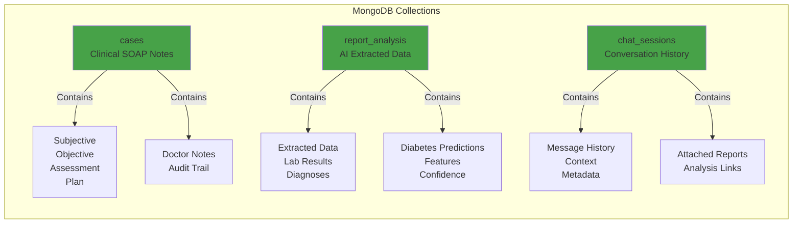

---

## 3. Authentication & Onboarding Flow

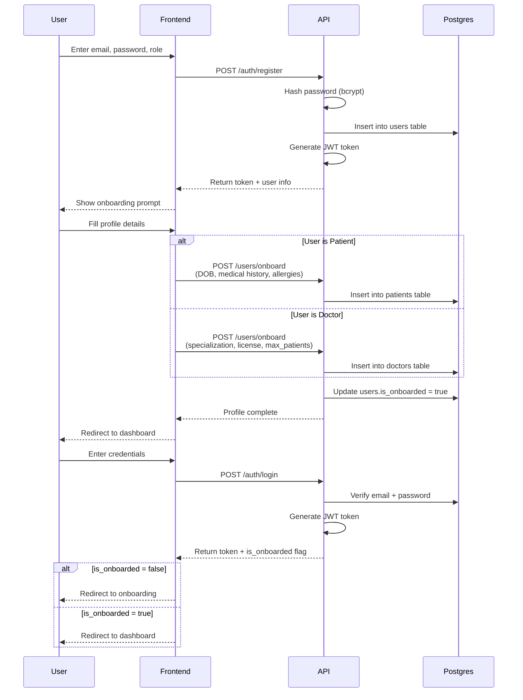

---

## 4. Doctor-Patient Assignment Flow

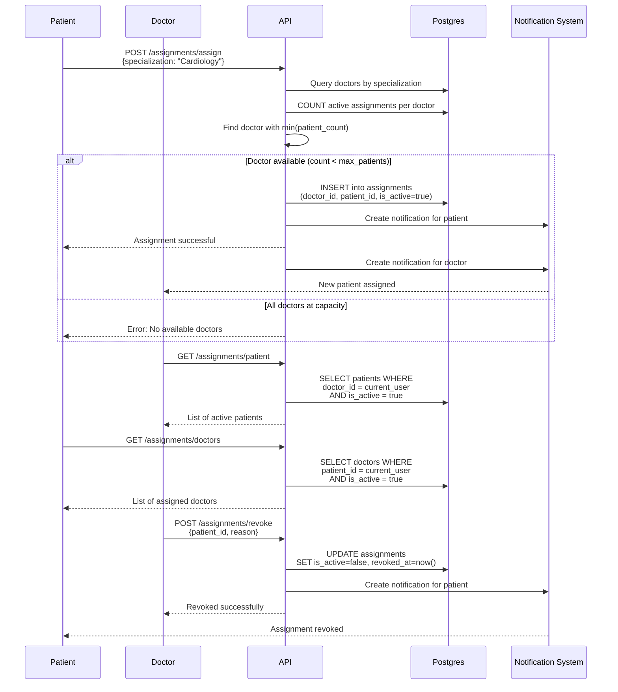

---

## 5. Medical Case Management Flow

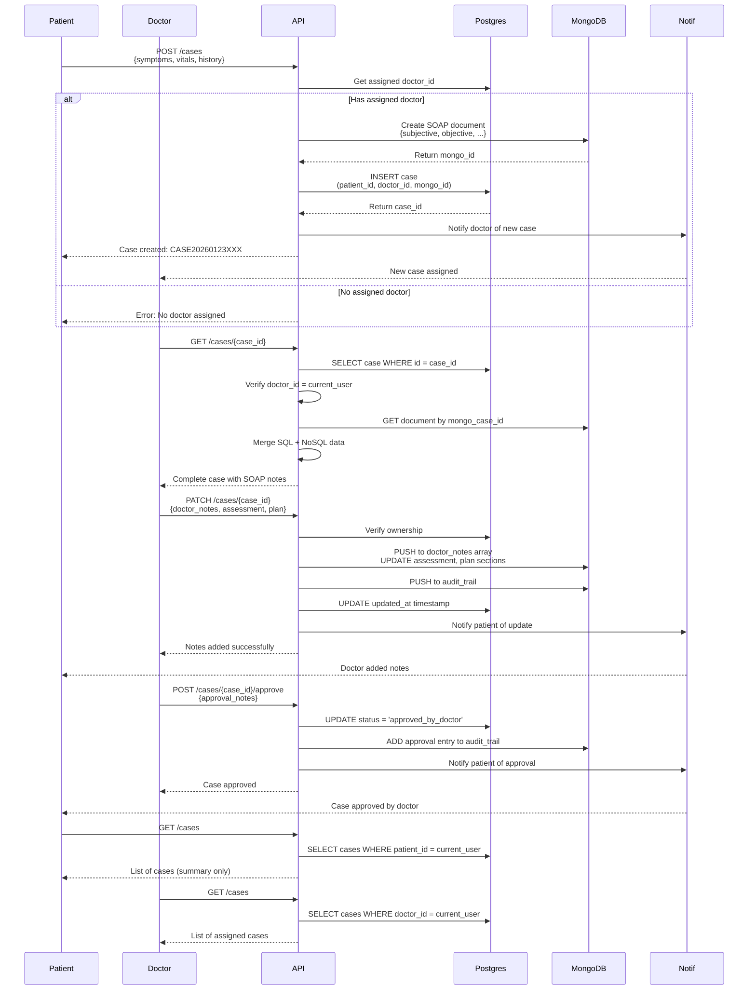

---

## 6. Report Upload & AI Analysis Flow

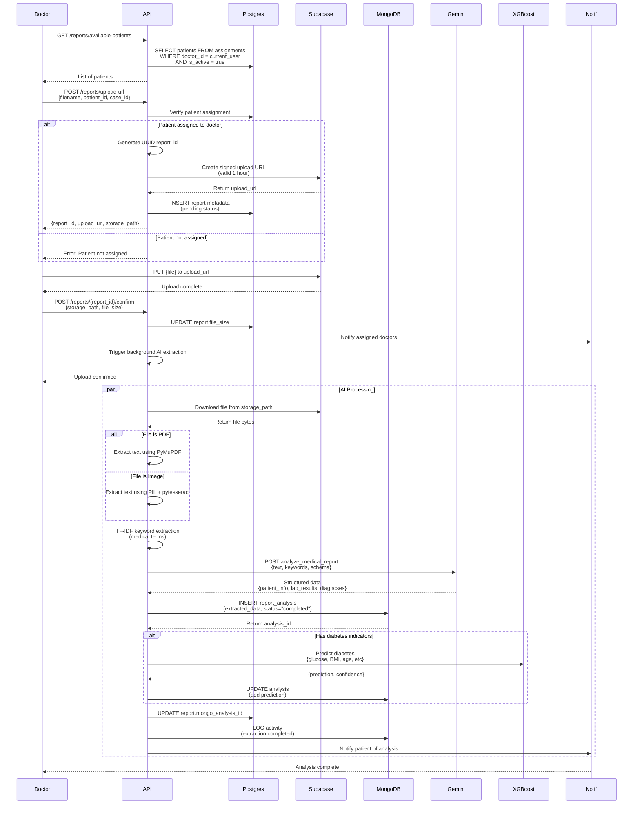

---

## 7. AI Chat System Flow

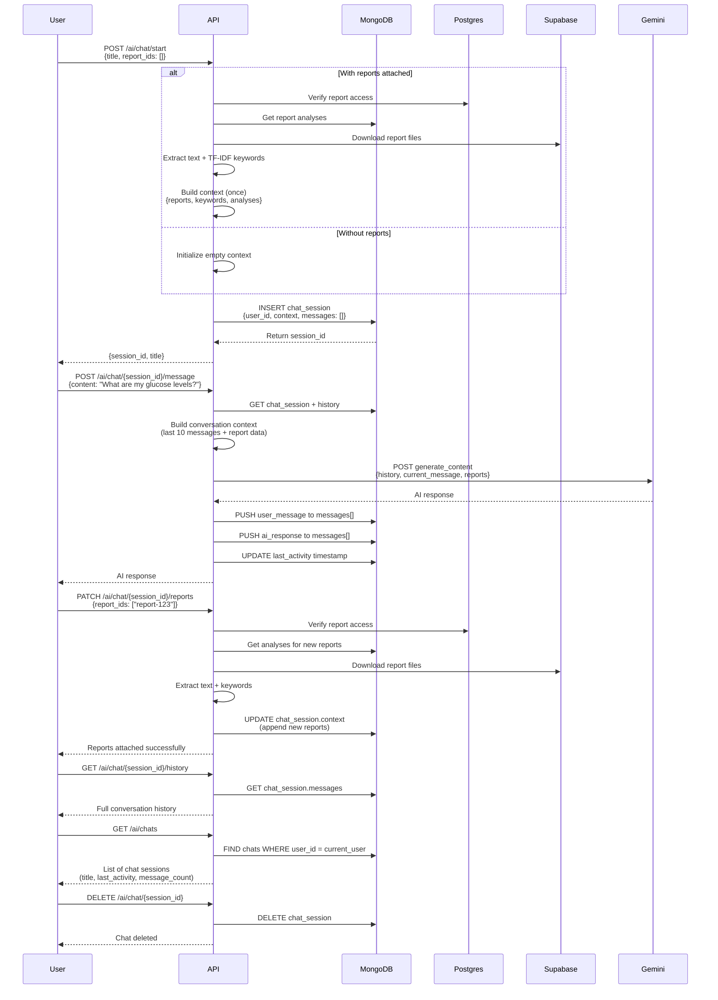

---

## 8. Diabetes Dashboard Flow

```mermaid
flowchart TD
    Start([Patient/Doctor Opens<br/>Diabetes Dashboard]) --> Auth{Authenticated?}
    
    Auth -->|No| Login[Redirect to Login]
    Auth -->|Yes| Role{User Role?}
    
    Role -->|Patient| GetPatientData[GET /patient/diabetes-dashboard]
    Role -->|Doctor| SelectPatient[Select Patient from List]
    SelectPatient --> GetDoctorData[GET /doctor/diabetes-dashboard/{patient_id}]
    
    GetPatientData --> CheckData{Has Diabetes<br/>Data?}
    GetDoctorData --> CheckData
    
    CheckData -->|No| EmptyState[Show Empty State<br/>"Upload reports for analysis"]
    
    CheckData -->|Yes| CheckConditions{Diabetes in<br/>Medical History<br/>OR<br/>AI Prediction?}
    
    CheckConditions -->|No| NoAccess[No diabetes data found]
    
    CheckConditions -->|Yes| FetchData[Fetch Data from:<br/>- MongoDB analyses<br/>- PostgreSQL user data<br/>- Report extractions]
    
    FetchData --> CalculateStatus{Calculate<br/>Diabetes Status}
    
    CalculateStatus -->|All Predictions = Diabetes| Diabetic[Status: DIABETIC]
    CalculateStatus -->|Some Predictions = Diabetes| AtRisk[Status: AT-RISK]
    CalculateStatus -->|No Predictions = Diabetes| Monitoring[Status: MONITORING]
    
    Diabetic --> BuildDashboard[Build Dashboard Data]
    AtRisk --> BuildDashboard
    Monitoring --> BuildDashboard
    
    BuildDashboard --> Aggregation[Aggregate:<br/>- Prediction history<br/>- HbA1c trends<br/>- Glucose trends<br/>- BMI history<br/>- Risk factors<br/>- Recommendations]
    
    Aggregation --> Response[Return Dashboard JSON]
    Response --> Display[Display:<br/>- Status badge<br/>- Latest prediction<br/>- Trend charts<br/>- Risk factors<br/>- Recommendations]
    
    Display --> Actions{User Action}
    
    Actions -->|Upload Report| ReportFlow[Go to Report Upload]
    Actions -->|View Details| DrillDown[Navigate to Report/Analysis]
    Actions -->|Refresh| Start
    
    style Diabetic fill:#ff6b6b
    style AtRisk fill:#ffa500
    style Monitoring fill:#4caf50
    style EmptyState fill:#e0e0e0
```

---

## 9. Notification System Flow

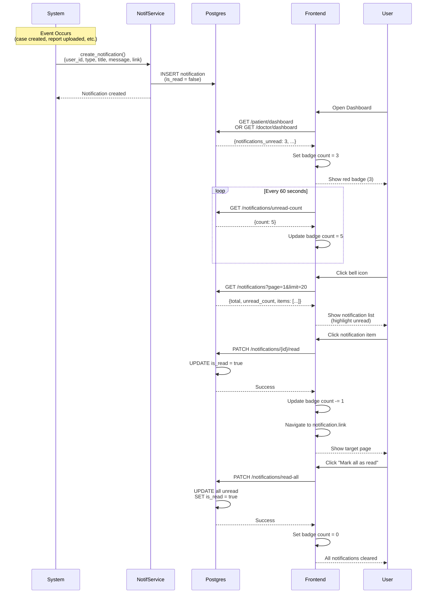

---

## 10. Complete User Journey

### 10.1 Patient Journey

```mermaid
graph TD
    Start([Patient Signs Up]) --> Register[POST /auth/register<br/>role: patient]
    Register --> Onboard[POST /users/onboard<br/>medical history, allergies]
    Onboard --> Dashboard[View Dashboard<br/>GET /patient/dashboard]
    
    Dashboard --> AssignDoc{Has Assigned<br/>Doctor?}
    
    AssignDoc -->|No| FindDoc[POST /assignments/assign<br/>specialization: Cardiology]
    FindDoc --> WaitApproval[Doctor Auto-Assigned<br/>Via Load Balancing]
    WaitApproval --> AssignDoc
    
    AssignDoc -->|Yes| CreateCase[POST /cases<br/>symptoms, vitals]
    CreateCase --> Notif1[Notification: Case Created]
    Notif1 --> UploadReport[POST /reports/upload-url<br/>Upload medical report]
    
    UploadReport --> ConfirmUpload[POST /reports/{id}/confirm]
    ConfirmUpload --> AIAnalysis[Background: AI Extracts Data]
    AIAnalysis --> Notif2[Notification: Analysis Complete]
    
    Notif2 --> ViewReport[GET /reports/{id}<br/>View analysis results]
    ViewReport --> DiabetesDash[GET /patient/diabetes-dashboard<br/>View diabetes trends]
    
    DiabetesDash --> StartChat[POST /ai/chat/start<br/>Attach reports]
    StartChat --> AskQuestions[POST /ai/chat/{id}/message<br/>"Explain my glucose levels"]
    AskQuestions --> GetResponse[Receive AI explanation]
    
    GetResponse --> DoctorReview{Doctor Added<br/>Notes?}
    DoctorReview -->|Yes| Notif3[Notification: Doctor Notes Added]
    Notif3 --> ViewCase[GET /cases/{case_id}<br/>View updated case]
    
    ViewCase --> Approved{Case<br/>Approved?}
    Approved -->|No| WaitApproval2[Wait for doctor approval]
    Approved -->|Yes| Notif4[Notification: Case Approved]
    Notif4 --> FollowUp[Create follow-up case<br/>if needed]
    FollowUp --> CreateCase
    
    WaitApproval2 --> DoctorReview
    
    style Start fill:#4CAF50
    style Notif1 fill:#FFC107
    style Notif2 fill:#FFC107
    style Notif3 fill:#FFC107
    style Notif4 fill:#FFC107
    style AIAnalysis fill:#2196F3
```

### 10.2 Doctor Journey

```mermaid
graph TD
    Start([Doctor Signs Up]) --> Register[POST /auth/register<br/>role: doctor]
    Register --> Onboard[POST /users/onboard<br/>specialization, license]
    Onboard --> Dashboard[View Dashboard<br/>GET /doctor/dashboard]
    
    Dashboard --> ViewPatients[GET /assignments/patient<br/>View assigned patients]
    ViewPatients --> Notif1[Notification: New Case Assigned]
    
    Notif1 --> ViewCases[GET /cases<br/>List all cases]
    ViewCases --> SelectCase[GET /cases/{case_id}<br/>Review case details]
    
    SelectCase --> ViewReports[GET /reports/patient/{patient_id}<br/>Review patient reports]
    ViewReports --> ViewAnalysis[Check AI analysis<br/>GET /ai/report/{report_id}]
    
    ViewAnalysis --> AvailablePatients[GET /reports/available-patients<br/>Check patients for upload]
    AvailablePatients --> UploadReport{Need to Upload<br/>Report?}
    
    UploadReport -->|Yes| GenerateURL[POST /reports/upload-url<br/>Select patient, upload file]
    GenerateURL --> ConfirmUpload[POST /reports/{id}/confirm<br/>Trigger AI analysis]
    ConfirmUpload --> Notif2[Notification: Analysis Complete]
    
    UploadReport -->|No| AddNotes[PATCH /cases/{case_id}<br/>Add assessment & plan]
    Notif2 --> AddNotes
    
    AddNotes --> Notif3[Notification: Patient notified<br/>of doctor notes]
    Notif3 --> ReviewStatus{Ready for<br/>Approval?}
    
    ReviewStatus -->|No| MoreInfo[Request more info<br/>Update case status]
    MoreInfo --> ViewCases
    
    ReviewStatus -->|Yes| ApproveCase[POST /cases/{case_id}/approve<br/>Add approval notes]
    ApproveCase --> Notif4[Notification: Patient notified<br/>of approval]
    
    Notif4 --> ViewDashboard[GET /doctor/diabetes-dashboard/{patient_id}<br/>Monitor patient health]
    ViewDashboard --> ViewPatients
    
    style Start fill:#2196F3
    style Notif1 fill:#FFC107
    style Notif2 fill:#FFC107
    style Notif3 fill:#FFC107
    style Notif4 fill:#FFC107
    style ApproveCase fill:#4CAF50
```

---

## 11. Module Interaction Map

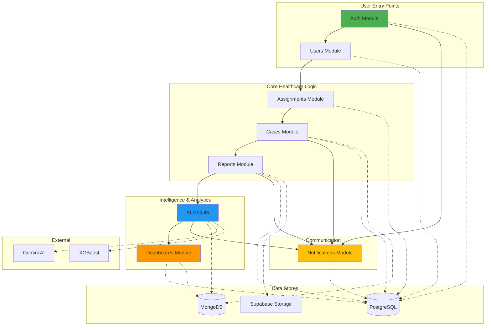

---

## 12. Data Flow: Report Upload to Diabetes Dashboard

```mermaid
flowchart LR
    subgraph "1. Upload"
        U1[Doctor/Patient<br/>Uploads Report]
        U2[Generate Upload URL]
        U3[Upload to Supabase]
        U4[Confirm Upload]
    end
    
    subgraph "2. AI Processing"
        A1[Download File]
        A2[Extract Text<br/>PDF/Image]
        A3[TF-IDF Keywords]
        A4[Gemini Analysis]
        A5[Extract Features]
        A6{Has Diabetes<br/>Indicators?}
        A7[XGBoost Prediction]
    end
    
    subgraph "3. Storage"
        S1[(PostgreSQL<br/>Report Metadata)]
        S2[(MongoDB<br/>Analysis Data)]
        S3[(Supabase<br/>File Storage)]
    end
    
    subgraph "4. Dashboard"
        D1[Check Access:<br/>Medical History<br/>OR AI Prediction]
        D2[Aggregate Data:<br/>All Reports +<br/>All Analyses]
        D3[Calculate Status:<br/>Diabetic/At-Risk]
        D4[Build Trends:<br/>HbA1c, Glucose, BMI]
        D5[Generate<br/>Recommendations]
        D6[Display Dashboard]
    end
    
    U1 --> U2 --> U3 --> U4
    U4 --> A1
    U3 --> S3
    
    A1 --> A2 --> A3 --> A4
    A4 --> A5 --> A6
    A6 -->|Yes| A7
    A6 -->|No| S2
    A7 --> S2
    
    U4 --> S1
    S2 --> S1
    
    S1 --> D1
    S2 --> D1
    D1 --> D2 --> D3 --> D4 --> D5 --> D6
    
    style A4 fill:#4285F4
    style A7 fill:#FF6B6B
    style D3 fill:#FFA500
    style D6 fill:#4CAF50
```

---

## 13. Security & Access Control Flow

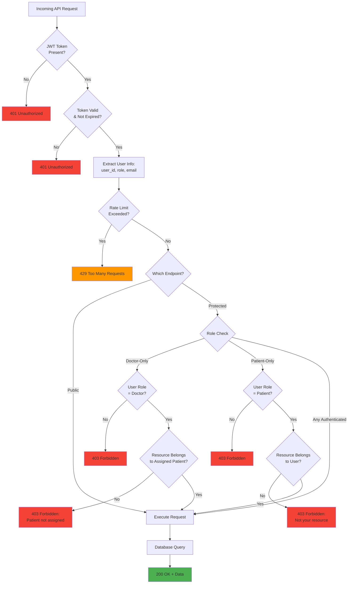

---

## 14. API Request/Response Pattern

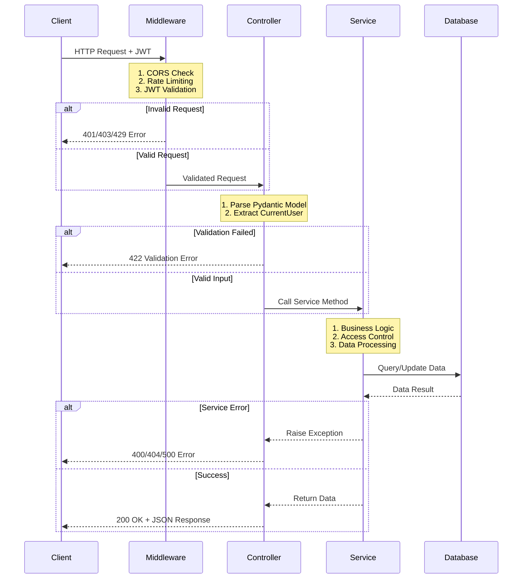

---

## 15. Background Task Processing

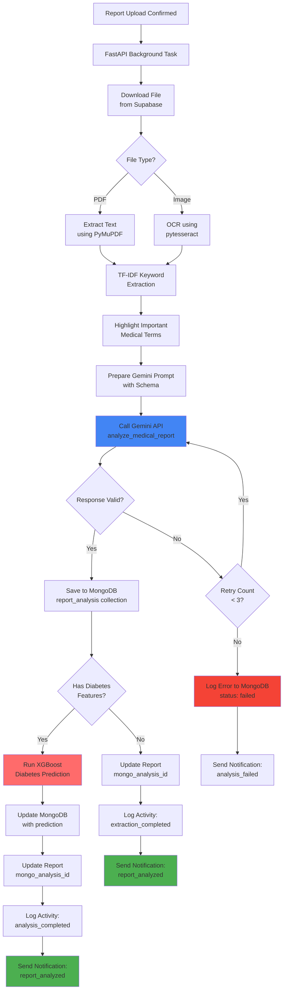

---

## Key Technologies Summary

| Layer | Technology | Purpose |
|-------|-----------|---------|
| **API Framework** | FastAPI | High-performance async Python framework |
| **Authentication** | JWT (HS256) + Passlib | Secure token-based auth with bcrypt hashing |
| **Relational DB** | PostgreSQL + SQLAlchemy | User accounts, assignments, case metadata |
| **Document DB** | MongoDB + PyMongo | Clinical SOAP notes, AI analyses, chat history |
| **File Storage** | Supabase Storage | Medical reports, images (PDF, PNG, JPEG) |
| **AI Analysis** | Google Gemini 2.5 Flash | Medical data extraction, conversational AI |
| **ML Prediction** | XGBoost | Diabetes risk prediction from lab results |
| **Keyword Extraction** | TF-IDF (scikit-learn) | Highlighting important medical terms for AI |
| **Rate Limiting** | SlowAPI | API request throttling |
| **CORS** | FastAPI Middleware | Cross-origin request handling |

---

## Notes for Implementation

1. **All API calls require JWT authentication** except:
   - `/auth/register`
   - `/auth/login`
   - `/assignments/specialities`

2. **Access Control Rules**:
   - Patients can only access their own data
   - Doctors can only access data for assigned patients
   - Assignments are checked at the service layer

3. **Dual-Write Pattern** (Cases):
   - PostgreSQL: Fast queries, relational integrity
   - MongoDB: Flexible clinical data, audit trails

4. **Background Processing**:
   - AI analysis runs asynchronously after report upload
   - No blocking of API responses
   - Notifications sent when processing completes

5. **Data Flow Direction**:
   - Patient creates case → Doctor assigned via workload balancing
   - Reports uploaded → AI extracts → Diabetes prediction (if applicable)
   - All updates trigger notifications to relevant users

---

**End of Document**

*This workflow documentation is maintained alongside code changes. Update diagrams when adding new features or changing flows.*
